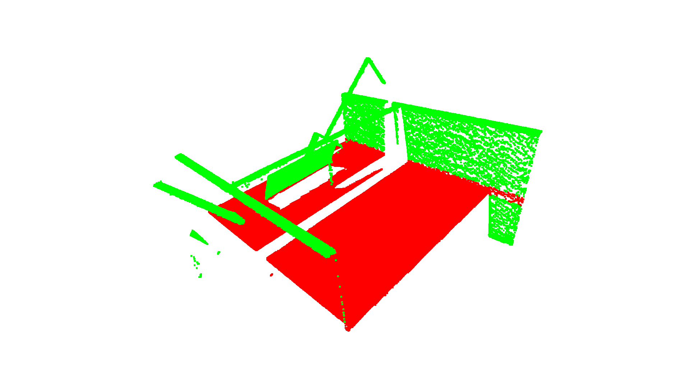
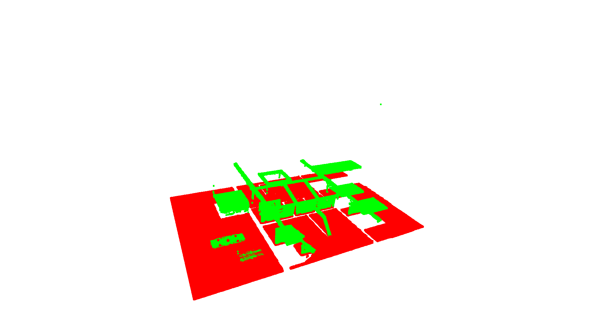

# Pointcloud_segmentation
Divide the bottom plate of the workpiece point cloud.

Visualization of segmentation results

  

Split_base_2.py adds the k-means method to first divide the point cloud into n blocks, and then perform dbscan clustering to solve the problem of bent or uneven bottom plates
